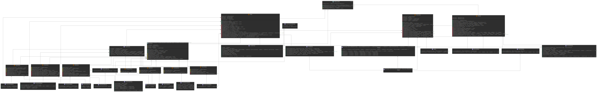

# AlRangeSlider

A customizable range slider jQuery plugin.
The second practical task for [MetaLamp](https://en.metalamp.io/education) Frontend education program.

### [Demo Page](https://aleinbanger.github.io/al-range-slider/examples)

***

## Table of Contents
* [Getting Started](#Getting-Started)
  * [Dependencies](#Dependencies)
  * [Installation](#Installation)
* [Usage](#Usage)
  * [Initialization](#Initialization)
  * [Configuration](#Configuration)
    * [Configuration Object](#Configuration-Object)
    * [Default Configuration](#Default-Configuration)
  * [State Object](#State-Object)
  * [Public Methods](#Public-Methods)
* [Contributing](#Contributing)
  * [Technologies](#Technologies)
  * [Setup and Scripts](#Setup-and-Scripts)
  * [Plugin Architecture](#Plugin-Architecture)
    * [Simple UML Class Diagram](#Simple-UML-Class-Diagram)
    * [Full UML Class Diagram](#Full-UML-Class-Diagram)
* [License](#License)

***

## Getting Started

### Dependencies
* [jQuery v.3.x](https://jquery.com/)

**Note:** The plugin doesn't use jQuery internally (only as a wrapper), so it can be easily converted to a vanilla JS plugin if needed.

### Installation

1. [Download TGZ package](https://github.com/Aleinbanger/al-range-slider/releases/download/v1.0.0/al-range-slider-1.0.0.tgz)

2. Install the package using NPM:
    ```
    npm install /path/to/al-range-slider-1.0.0.tgz
    ```

3. Import JS (global jQuery type definitions are imported automatically):
    ```ts
    import 'al-range-slider';
    ```

4. Import specific types like this, if needed:
    ```ts
    import { TOptions } from 'al-range-slider';
    ```

5. Import CSS using a bundler:
    ```ts
    import 'node_modules/al-range-slider/build/plugin/css/al-range-slider.css';
    ```

Or [download ZIP](https://github.com/Aleinbanger/al-range-slider/releases/download/v1.0.0/al-range-slider-1.0.0.zip) and import all files accordingly.


## Usage

### Initialization
The slider should be initialized on an empty `<div>` element, `<input>` elements are created automatically for each knob. See the [Configuration](#Configuration) section for details.
```html
<div class="js-example-class"></div>
```

```ts
// with default settings
$('.js-example-class').alRangeSlider();

// with custom settings
const options: TOptions = {
  range: { min: -100, max: 100, step: 1 },
  initialSelectedValues: { from: -50, to: 50 },
  grid: { minTicksStep: 1, marksStep: 5 },
};
$('.js-example-class').alRangeSlider(options);
```

### Configuration

The slider can be initialized in 3 ways:
* `range`: a usual combination of `min`, `max`, `step` `number`s; suitable for large ranges, provides the best performance, can be greatly customized with `prettify` option.

* `valuesArray`: an array of either `number`s or `string`s; `number` values are positioned on the track proportionally, which can provide unequal step; also can be customized with `prettify` option; the array is converted to `pointsMap` and stored internally, so this method is **not suitable for large ranges**.

* `pointsMap`: same as `valuesArray` but with manual positioning; the points map is an object, where each key is a position ratio (`number`s from 0 to 1) and a corresponding value is any `number` or `string`; it allows for custom positioning of `number` and `string` values; also can be customized with `prettify` option; the points map is stored internally, so this method is **not suitable for large ranges**.

The type of slider and the number of knobs are determined automatically from `initialSelectedValues` config property, which is an object where the keys are knobs IDs (`string`s) and the values are their initial selected values (`string`s or `number`s).
Each knob corresponds to `<input name="...">` with the same name.
If it starts with `'from'` or `'to'`, the knob will be connected to a progress bar;
`` `from${tail}` `` &mdash; `` `to${tail}` `` pairs with the same `tail` will create range progress bars.

#### Configuration Object
```ts
type TPointValue = number | string;
type TPointsMap = [position: string, value: TPointValue][];
type TOrientation = 'horizontal' | 'vertical';
type TTheme = 'light' | 'dark';

interface IProps {
  // an object where the keys are knobs IDs and the values are their initial selected values
  readonly initialSelectedValues: Record<string, TPointValue>;

  // the argument of .toFixed(), used for rounding fractional values
  readonly valuesPrecision: number;

  // toggles knobs collision and prevents them from passing through each other
  readonly collideKnobs: boolean; 

  // initializes the slider from a range object
  range?: {
    min: number; // minimum value
    max: number; // maximum value
    step: number; // value step (> 0, can be fractional)
  };

  // initializes the slider from a values array, takes priority over 'range' and 'pointsMap'
  valuesArray?: number[] | string[];

  // initializes the slider from a points map, takes priority over 'range'
  pointsMap?: Record<number, TPointValue>;

  // defines the slider's orientation
  readonly orientation: TOrientation;

  // defines the slider's theme
  readonly theme: TTheme;

  // configures the slider's grid
  readonly grid: {
    // min step of minor ticks, increased automatically to avoid overlapping
    readonly minTicksStep: number;
    // step of major ticks with marks (labels)
    readonly marksStep: number;
    // a custom points map to override the generated grid
    readonly pointsMap?: TPointsMap; 
  };

  // toggles smooth transition of knobs between allowed positions
  readonly allowSmoothTransition: boolean;

  // toggles automatic creation of inputs, 'hidden' hides them to be used in forms
  readonly showInputs: boolean | 'hidden';

  // toggles tooltips
  readonly showTooltips: boolean; 

  // toggles tooltip collision and merging
  readonly collideTooltips: boolean;

  // separates values in a tooltip when 'collideTooltips' is true
  readonly tooltipsSeparator: string;

  // a prettify function, affects displayed values on the grid and tooltips but not inputs
  readonly prettify?: (value: string) => string;

  // user callbacks
  readonly onInit?: (state?: IState) => void; // called on slider initialization
  readonly onStart?: (state?: IState) => void; // called on starting a point change
  readonly onFinish?: (state?: IState) => void; // called on finishing a point change
  readonly onChange?: (state?: IState) => void; // called on each point change
  readonly onUpdate?: (state?: IState) => void; // called when public 'update' method is used
}

type TOptions = Partial<IProps>;
```

#### Default Configuration
```ts
const defaults: IProps = {
  initialSelectedValues: { to: 0 },
  valuesPrecision: 4,
  collideKnobs: true,
  range: { min: 0, max: 100, step: 1 },
  orientation: 'horizontal',
  theme: 'light',
  grid: { minTicksStep: 1, marksStep: 1 },
  allowSmoothTransition: true,
  showInputs: true,
  showTooltips: true,
  collideTooltips: true,
  tooltipsSeparator: ' \u2192 ',
};
```

### State Object
The state object can be passed in callbacks to get the slider's state.

```ts
type TPoint = [position: number, value: TPointValue];

interface IState {
  // an object where the keys are IDs and the values are [position, value] tuples
  selectedPoints?: Record<string, TPoint>;

  // an object where the keys are IDs and the values are position limits
  selectedPointsLimits?: Record<string, { min: number; max: number }>;

  // an object where the keys are IDs and the values are selected values 
  selectedValues?: Record<string, TPointValue>;

  // an object where the keys are IDs and the values are prettified selected values
  selectedPrettyValues?: Record<string, string>;

  // a tuple, last selected position
  currentPosition?: [id: string, position: number];

  // a tuple, last selected limits
  currentPositionLimits?: [id: string, limits: { min: number; max: number }];

  // a tuple, last active status
  currentActiveStatus?: [id: string, active: boolean];

  // a tuple, last selected value
  currentValue?: [id: string, value: string];
}
```

### Public Methods
```ts
interface IData {
  // an object where the keys are IDs and the values are selected values
  values?: IProps['initialSelectedValues'];

  // an object where the keys are IDs and the values are positions (0 -- 1)
  positions?: Record<string, number>;
}

interface IMethods {
  // destroys the slider and removes its event listeners
  destroy(): void;

  // disables and enables the slider
  disable(disabled?: boolean): void;

  // restarts the slider, optionally with new settings
  restart(props?: Partial<IProps>): void;

  // updates the slider's state using either values or positions (0 -- 1)
  update(data?: IData): void;
}
```

To use the public methods, save the slider instance to a variable during initialization:
```ts
const options: TOptions = {
  range: { min: -100, max: 100, step: 1 },
  initialSelectedValues: { from: -50, to: 50 },
  grid: { minTicksStep: 1, marksStep: 5 },
};
const sliderInstance = $('.js-example-class').alRangeSlider(options);
```
And call methods like this:
```ts
// disable the slider (including inputs)
sliderInstance.alRangeSlider('disable');

// enable the slider
sliderInstance.alRangeSlider('disable', false);

// restart with vertical orientation
sliderInstance.alRangeSlider('restart', {
  orientation: 'vertical',
});

// select values for the knobs with IDs 'from' and 'to'
sliderInstance.alRangeSlider('update', {
  values: { from: -10, to: 10 },
});
```

***

## Contributing

### Technologies
* **Source code:** [TypeScript](https://www.typescriptlang.org/)
* **Compiling TypeScript to ES5:** [Babel](https://babeljs.io/)
* **Polyfills:** [core-js](https://babeljs.io/docs/en/babel-preset-env#corejs)
* **Plugin wrapper:** [jQuery](https://jquery.com/)
* **Testing:** [Jest](https://jestjs.io/)
* **Styles:** [SCSS](https://sass-lang.com/), [PostCSS](https://postcss.org/)
* **Demo page markup:** [Pug](https://pugjs.org/api/getting-started.html)
* **Bundling:** [Webpack](https://webpack.js.org/)

### Setup and Scripts

* Clone the repository and install its dependencies:
  ```
  git clone https://github.com/Aleinbanger/al-range-slider.git
  npm install
  ```

* Launch dev-server:
  ```
  npm run dev
  ```

* Run type checking and tests:
  ```
  npm run test
  ```

* Build the plugin:
  ```
  npm run prod-plugin
  ```

* Build the demo page:
  ```
  npm run prod-demo
  ```

* Deploy the demo page to GitHub Pages:
  ```
  npm run deploy-demo
  ```

### Plugin Architecture

The project uses the **MVP** architectural pattern:
* `Model` defines the data to be displayed or otherwise acted upon in the user interface, notifies `Presenter` about any changes in its state using the **Observer** pattern. Here it is responsible for determining and keeping the relation between currently selected values and their corresponding positions on the grid.
* `View` displays the data (`Model`), notifies `Presenter` about user commands (events) using the **Observer** pattern to act upon that data.
    * `SubViews` are independent components of `View`, they notify `View` about specific user commands also using the **Observer** pattern.
* `Presenter` acts upon `Model` and `View`. Subscribes to `View`, gets notifications from it and correspondingly updates `Model`. Subscribes to `Model`, gets notifications from it and correspondingly updates `View`. It is the entry point to the plugin and provides the API.

#### Simple UML Class Diagram


#### Full UML Class Diagram



## License
This project is licensed under the MIT License. See the `LICENSE` file for details.
